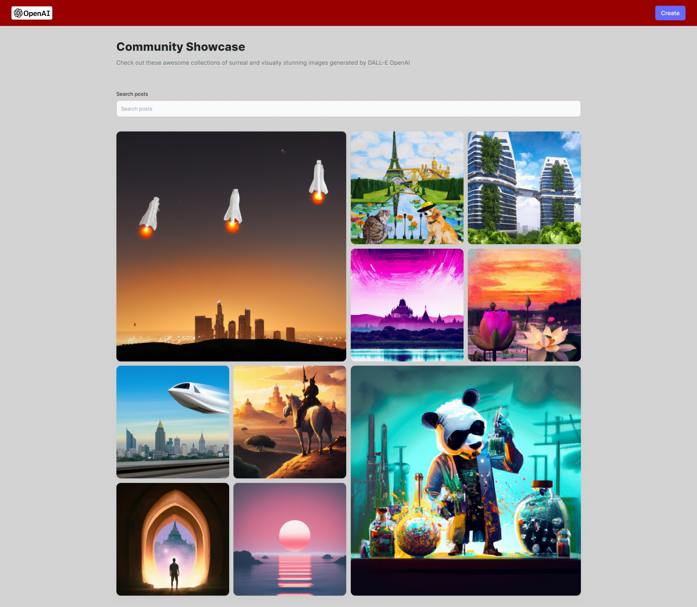
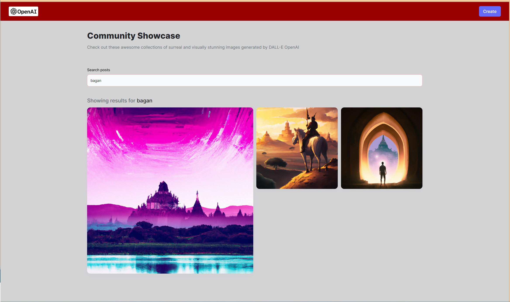
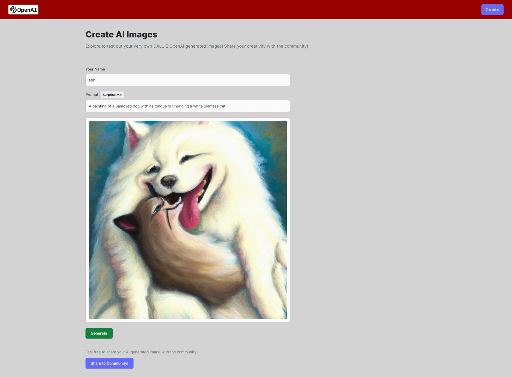
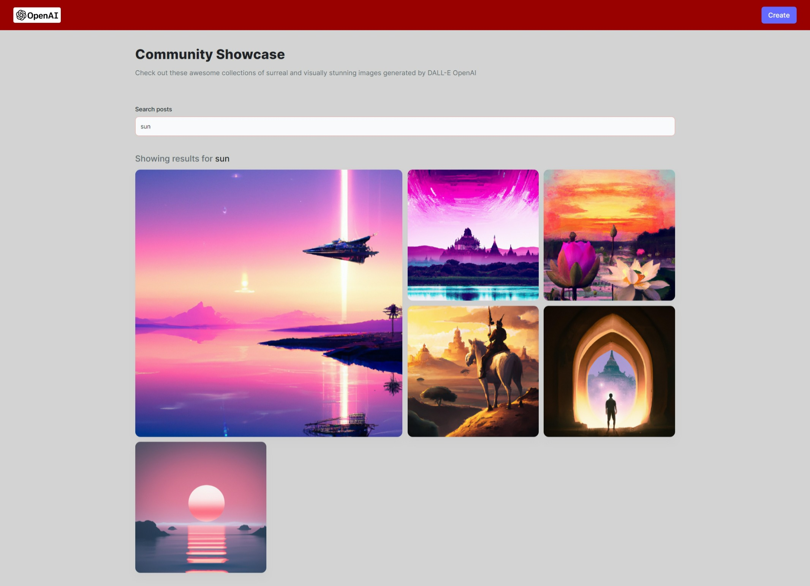

# Project Title: [ AI-Image-Generation-MERN-App ]

Deployed on Vercel Live URL: [https://min-journey-ai-image-dall-e.vercel.app/]

## Table of Contents
1. [Description](#description)
2. [Installation](#installation)
3. [Usage](#usage)
4. [Contributing](#contributing)
5. [Tests](#tests)
6. [License](#license)
7. [Questions](#questions)

-----

### Description 
This project is a MERN stack web application that utilizes OpenAI's Dall-E model to generate AI images based on user text prompts. The app will have a modern and minimal design, with a dynamic image layout. The user will be able to input text prompts and the app will generate AI images based on the text. The user will also be able to customize the image layout, allowing them to create unique and creative images. The app will also feature a gallery of AI images created by other users, allowing users to explore and discover new images. The app will also feature a search function, allowing users to quickly find images based on keywords.

-----

### Installation
Cloudinary
CORS
OpenAI
MongoDB/Mongoose
Express.js
Node.js

### Tech-Stacks
OpenAI - Dall-E Model,
Cloudinary,
MongoDB
React,
Tailwind CSS,
HTML5,
Vite

-----

### Usage 

Open Source

-----
#### User Story

As a user, I want to be able to generate AI images on a web app so that I can create unique images for my projects.

#### Acceptance Criteria:

1. The web app should be built using the MERN stack.

2. The web app should have a user-friendly interface.

3. The web app should allow users to upload images and generate AI images.

4. The web app should allow users to customize the AI images.

5. The web app should allow users to save and share the AI images.

-----

### Contributing 
YES 

-----

### Tests 
Jest

-----

### License 
MIT 

-----

Deployed on Vercel Live URL: [https://min-journey-ai-image-dall-e.vercel.app/]

### Questions 

#### GitHub Username: min-hinthar 

#### GitHub URL: https://github.com/min-hinthar

#### GitHub Repo: https://github.com/min-hinthar/AI-Image-Generation-MERN-App

#### Email: min@mandalaymorningstar.com

-----
